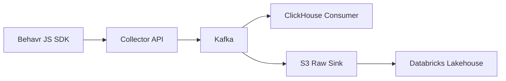

# Behavr API (Collector)

Spring Boot **ingestion gateway** for the **Behavr** JavaScript SDK (`src/main/resources/behavr.js`): accepts batched browser events over HTTP, validates them, enriches them with server metadata, and publishes each event to **Apache Kafka**.

Detailed behavior is specified in [`docs/collector-api-spec.md`](docs/collector-api-spec.md).

```text
receive → validate → enrich → publish to Kafka → HTTP 202 Accepted
```

Heavy analytics and storage live downstream (object storage, ClickHouse, lakehouse, etc.), not in this service.

---

## Architecture



---

## Why This Service Exists

The collector is intentionally designed as a thin ingestion gateway.

This architecture:

- minimizes ingestion latency
- isolates downstream failures
- enables replayability through Kafka
- supports independent consumers
- separates ingestion from analytics and storage
- allows realtime and historical analytics pipelines

The Collector API is intentionally **stateless** and does not perform heavy transformations or analytical processing.

---

## Architectural Decisions

- Kafka is used as the central event backbone.
- Events are published individually to support replayability and independent downstream consumers.
- The Collector API remains stateless and horizontally scalable.
- Heavy analytics and storage are intentionally excluded from the ingestion layer.
- ClickHouse is planned as the realtime serving layer.
- Databricks + Delta Lake are planned as the historical lakehouse layer.

---

## Stack

- **Java 21**
- **Spring Boot 4.x** ([Spring Boot reference](https://docs.spring.io/spring-boot/))
- **Spring WebFlux** (reactive HTTP)
- **Spring for Apache Kafka** (producer + optional topic creation)
- **Jakarta Validation**
- **Spring Boot Actuator**
- **Prometheus registry**
- **Lombok**
- **Maven**
- Optional **Spring Boot Docker Compose** for local Kafka + UI

---

## Requirements

- **JDK 21+**
- **Docker Desktop** (or compatible engine) for local Kafka when using the default `local` profile with Compose
- For production Kafka: a [Confluent Cloud](https://confluent.cloud) cluster (or any Kafka compatible with SASL/SSL + PLAIN and the configured topic)

---

## Quick Start (local)

### 1. Clone the repository

```bash
git clone <repo-url>
cd behavr-api
```

---

### 2. Start the application

Docker Compose starts **Kafka** and **Kafka UI** automatically when the `local` profile is active and Docker is running.

```bash
./mvnw spring-boot:run
```

On Windows:

```powershell
.\mvnw.cmd spring-boot:run
```

---

### 3. Health endpoint

```text
http://localhost:8080/actuator/health
```

---

### 4. Ingest events

```http
POST http://localhost:8080/v1/events
```

Example requests:

```text
http/collector-events.http
```

Compatible with:
- IntelliJ HTTP Client
- VS Code REST Client

---

### 5. Browse Kafka

```text
http://localhost:8081
```

Cluster:

```text
behavr-local
```

Topic:

```text
behavr.events.raw
```

---

### 6. Metrics endpoint

```text
http://localhost:8080/actuator/prometheus
```

---

## Local Compose Services

| Service | Host Port | Notes |
|---|---|---|
| Kafka | `9092` | PLAINTEXT for apps on host |
| Kafka UI | `8081` | Bootstrap inside Docker: `kafka:29092` |

`compose.yaml` uses `bitnamilegacy/kafka` with dual listeners so both the host app and Kafka UI resolve brokers correctly.

---

## Configuration

### Profiles

| Profile | Purpose |
|---|---|
| `local` (default) | Docker Compose Kafka, no `X-Behavr-Site-Key` required |
| `prod` | Confluent Cloud (or external Kafka), requires site API key header |

Activate `prod`:

```bash
./mvnw spring-boot:run -Dspring-boot.run.profiles=prod
```

Or:

```bash
export SPRING_PROFILES_ACTIVE=prod
./mvnw spring-boot:run
```

---

## Environment and `.env`

On startup, a project-root `.env` file is loaded via `dotenv-java`.

OS environment variables override `.env` values.

### Setup

```bash
cp .env.example .env
```

Fill in Confluent Cloud variables for `prod`.

`.env` is gitignored.

---

### Required Confluent Variables

| Variable | Description |
|---|---|
| `CONFLUENT_BOOTSTRAP_SERVERS` | Kafka bootstrap servers |
| `CONFLUENT_API_KEY` | SASL username |
| `CONFLUENT_API_SECRET` | SASL password |

---

## Site API Key (`prod`)

HTTP header:

```http
X-Behavr-Site-Key
```

Allowed site keys are configured under:

```yaml
behavr:
  sites:
```

Mapping:

```text
site_id → secret key
```

---

## Kafka Topic

Default topic:

```text
behavr.events.raw
```

Configuration:

```yaml
behavr:
  kafka:
    topic: behavr.events.raw
```

### Topic Creation

With:

```yaml
behavr.kafka.ensure-topic: true
```

Spring attempts to create the topic automatically.

Local defaults:
- partitions: 1
- replication factor: 1

Production defaults:
- partitions: 3
- replication factor: 3

If Confluent permissions do not allow topic creation:
- create topic manually
- disable automatic topic creation

---

## CORS

Local CORS allows common frontend development origins:

- `http://localhost:3000`
- `http://localhost:5173`

Production CORS should be restricted to registered customer domains.

---

## API Summary

| Method | Path | Description |
|---|---|---|
| `POST` | `/v1/events` | Accept SDK batch |
| `GET` | `/actuator/health` | Health endpoint |
| `GET` | `/actuator/prometheus` | Metrics endpoint |

All request/response fields use `snake_case` JSON to match the SDK.

Example payload:

```text
docs/examples/events-batch.json
```

---

## Tests

```bash
./mvnw test
```

Controller tests mock Kafka publishing and do not require a running Kafka broker.

---

## Project Layout

Main code lives under:

```text
net.behavr.collector
```

| Package | Responsibility |
|---|---|
| `config` | Kafka, CORS, typed properties |
| `controller` | WebFlux endpoints |
| `dto` | Request/response models |
| `exception` | Global exception handling |
| `kafka` | Kafka publisher |
| `model` | Internal event models |
| `service` | Validation, enrichment, metrics |
| `support` | Request metadata extraction |
| `validation` | Batch and event validation |

Application entrypoint:

```text
net.behavr.api.ApiApplication
```

---

## Documentation

- [Collector API specification](docs/collector-api-spec.md)
- [Example event batch](docs/examples/events-batch.json)

---

## Planned Components

Future services planned for the Behavr platform:

- ClickHouse realtime consumer
- S3 raw event sink
- Databricks lakehouse ingestion
- Delta Lake bronze/silver/gold pipelines
- Recommendation engine
- Multi-tenant API keys
- Dashboard APIs
- Behavioral analytics engine

---

## Long-Term Platform Vision

Behavr is evolving into:

```text
behavioral intelligence platform for e-commerce
```

The collector is the first foundational component of a larger event-driven analytics architecture.

---

## License

Licensed under the Apache License 2.0.

See [LICENSE](LICENSE) for details.