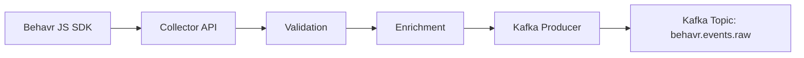

# Behavr Collector API

## Technical Development Specification

This document is a technical development specification **Behavr Collector API**.

The initial Spring Boot project has already been created via Spring Initializr.

---

# 1. Project Goal

Build the first version of the **Behavr Collector API**.

The Collector API receives behavioral event batches from the Behavr JavaScript SDK and publishes validated events to Kafka.

The API must be intentionally thin:

```text
receive → validate → enrich → publish to Kafka → return 202 Accepted
```

Heavy processing must NOT happen inside the Collector API.

Downstream systems will later consume Kafka events and write them to:

* Cloud object storage
* ClickHouse
* Databricks lakehouse

---

# 2. Target Architecture



---

# 3. Technology Stack

Use the existing Spring Boot project.

Expected stack:

* Java 21+
* Spring Boot 4.x or 3.x, depending on generated project
* Spring WebFlux
* Spring for Apache Kafka
* Jakarta Validation
* Actuator
* Micrometer / Prometheus if already included
* Lombok if already included
* Maven

Do not add unnecessary dependencies unless required.

Do NOT add:

* JPA
* relational database
* OAuth/JWT security
* complex persistence layer

This service is an ingestion gateway, not a CRUD application.

---

# 4. Main Endpoint

## POST /v1/events

Receives a batch of browser events from the Behavr SDK.

### Request Example

```json
{
  "site_id": "site_123",
  "sent_at": "2026-05-11T20:00:00Z",
  "events": [
    {
      "event_id": "8f3dd1c7-0b7c-4baf-91a8-8f41d9d7d4c1",
      "event_type": "search",
      "site_id": "site_123",
      "anonymous_id": "anon_123",
      "session_id": "session_456",
      "occurred_at": "2026-05-11T20:00:00Z",
      "url": "https://shop.example.com/search?q=hoodie",
      "path": "/search",
      "title": "Search results",
      "referrer": "https://google.com",
      "user_agent": "Mozilla/5.0",
      "browser_language": "en-US",
      "device_type": "desktop",
      "sdk_version": "1.0.0",
      "utm": {
        "utm_source": "google",
        "utm_medium": "cpc"
      },
      "properties": {
        "query": "hoodie",
        "results_count": 12,
        "source": "live_input"
      }
    }
  ]
}
```

### Successful Response

Return HTTP 202.

```json
{
  "status": "accepted",
  "accepted_events": 1,
  "rejected_events": 0
}
```

### Validation Error Response

Return HTTP 400.

```json
{
  "status": "invalid_request",
  "message": "events must not be empty"
}
```

---

# 5. Required Package Structure

Create or adjust packages like this:

```text
net.behavr.collector
  ├── config
  ├── controller
  ├── dto
  ├── kafka
  ├── service
  ├── validation
  ├── exception
  └── model
```

---

# 6. DTOs

Create DTOs for incoming requests.

## EventBatchRequest

Fields:

```java
String siteId;
Instant sentAt;
List<EventRequest> events;
```

Validation:

* `siteId` required
* `sentAt` optional but recommended
* `events` required
* `events` must not be empty
* max batch size configurable, default 100

Use JSON property names compatible with SDK:

```json
site_id
sent_at
```

---

## EventRequest

Fields:

```java
String eventId;
String eventType;
String siteId;
String anonymousId;
String sessionId;
Instant occurredAt;
String url;
String path;
String title;
String referrer;
String userAgent;
String browserLanguage;
String deviceType;
String sdkVersion;
Map<String, Object> utm;
Map<String, Object> properties;
```

Validation:

* `eventId` required
* `eventType` required
* `siteId` required
* `anonymousId` required
* `sessionId` required
* `occurredAt` required
* `url` required
* `properties` optional

Allowed event types for MVP:

```text
page_view
search
product_view
product_click
add_to_cart
checkout_start
purchase
```

If an unknown event type is received, reject it for now.

---

## EventBatchResponse

Fields:

```java
String status;
int acceptedEvents;
int rejectedEvents;
```

JSON:

```json
{
  "status": "accepted",
  "accepted_events": 10,
  "rejected_events": 0
}
```

---

# 7. Internal Kafka Event Model

Create an internal model that will be serialized to Kafka.

## CollectedEvent

Fields:

```java
String eventId;
String eventType;
String siteId;
String anonymousId;
String sessionId;
Instant occurredAt;
Instant receivedAt;
Instant batchSentAt;
String url;
String path;
String title;
String referrer;
String userAgent;
String browserLanguage;
String deviceType;
String sdkVersion;
Map<String, Object> utm;
Map<String, Object> properties;
ServerContext serverContext;
```

## ServerContext

Fields:

```java
String ipAddress;
String userAgent;
String requestId;
```

Important:

* `receivedAt` must be generated by server.
* `requestId` should be generated per HTTP request.
* Do not trust client time for server-side ingestion time.

---

# 8. Kafka Requirements

## Topic

Default topic:

```text
behavr.events.raw
```

Make topic configurable through application properties:

```yaml
behavr:
  kafka:
    topic: behavr.events.raw
```

---

## Kafka Key

Use this Kafka key:

```text
site_id:event_id
```

Reason:

* helps with ordering/grouping by site/event
* useful for downstream deduplication

---

## Kafka Value

Serialize `CollectedEvent` as JSON.

Use Spring Kafka with JSON serializer or custom ObjectMapper-based serializer.

---

# 9. Services

## EventCollectorService

Responsibilities:

* accept `EventBatchRequest`
* validate batch-level consistency
* enrich events with server metadata
* publish events to Kafka
* return accepted/rejected counts

Rules:

* request `site_id` must match each event `site_id`
* empty events list is invalid
* event count must not exceed configured max batch size
* events are published individually to Kafka

---

## EventPublisher

Responsibilities:

* publish `CollectedEvent` to Kafka
* return async completion if using reactive style
* log publish errors

For first version, it is acceptable to publish using `KafkaTemplate`.

If project uses WebFlux, controller can return `Mono<ResponseEntity<EventBatchResponse>>`, but the Kafka producer itself may remain imperative for simplicity.

---

# 10. Controller

Create:

```text
EventCollectorController
```

Endpoint:

```http
POST /v1/events
```

Behavior:

* accepts JSON
* validates request
* calls `EventCollectorService`
* returns 202 Accepted on success
* returns 400 on validation errors

Response status:

```text
202 Accepted
```

Do not return 200 for accepted ingestion.

---

# 11. Error Handling

Create a global exception handler:

```text
GlobalExceptionHandler
```

Handle:

* validation errors
* invalid event type
* batch size exceeded
* site mismatch
* malformed JSON

Use consistent response shape:

```json
{
  "status": "error",
  "message": "..."
}
```

---

# 12. Configuration

Add typed properties:

```yaml
behavr:
  collector:
    max-batch-size: 100
    allowed-event-types:
      - page_view
      - search
      - product_view
      - product_click
      - add_to_cart
      - checkout_start
      - purchase
  kafka:
    topic: behavr.events.raw
```

Create:

```text
BehavrCollectorProperties
BehavrKafkaProperties
```

Use `@ConfigurationProperties`.

---

# 13. Observability

Add basic logs and metrics.

## Logs

Log:

* request received
* site_id
* number of events
* validation failures
* Kafka publish failures

Do NOT log full payloads by default.

Reason:

* payload can be large
* may contain sensitive metadata

---

## Metrics

If Micrometer is available, add counters:

```text
behavr_events_received_total
behavr_events_accepted_total
behavr_events_rejected_total
behavr_kafka_publish_errors_total
```

Tags:

```text
site_id
event_type
```

Keep tags controlled to avoid high cardinality. Do NOT tag by event_id, session_id, URL, or query.

---

# 14. Security for MVP

Do not implement OAuth/JWT yet.

Add simple API key support if time allows:

Header:

```http
X-Behavr-Site-Key: <site_key>
```

For first version:

* accept requests without auth in `local` profile
* require key in `prod` profile

API key validation can be stubbed with in-memory config.

Example:

```yaml
behavr:
  sites:
    site_123: test_secret_key
```

If this is too much for first iteration, leave a TODO and keep API open only for local development.

---

# 15. CORS

Allow browser SDK calls.

For local development:

```text
http://localhost:3000
http://localhost:5173
```

For production, CORS should be restricted by registered customer domains.

Implement simple permissive CORS for MVP if needed, but add TODO comment explaining production restriction.

---

# 16. Testing Requirements

Create tests for:

## Controller Tests

* valid request returns 202
* empty events returns 400
* missing site_id returns 400
* unknown event_type returns 400
* event site_id mismatch returns 400

## Service Tests

* transforms request to CollectedEvent
* adds receivedAt
* adds requestId
* publishes correct Kafka key
* rejects batch exceeding max size

## Kafka Publishing Test

Mock publisher or KafkaTemplate.

Do not require real Kafka for unit tests.

---

# 17. Local Development

If Docker Compose support exists, create docker-compose for Kafka.

Minimum local dependencies:

```text
Kafka
Kafka UI optional
```

Future dependencies:

```text
ClickHouse
MinIO
```

But do not implement ClickHouse or S3 sink in this API project yet.

This Collector API publishes to Kafka only.

---

# 18. Acceptance Criteria

The task is complete when:

1. Application starts successfully.
2. `POST /v1/events` accepts a valid SDK batch.
3. Invalid payloads return 400.
4. Valid events are transformed into `CollectedEvent`.
5. Events are published individually to Kafka topic `behavr.events.raw`.
6. Response returns HTTP 202 with accepted event count.
7. Unit/controller tests pass.
8. Application has basic health endpoint through Actuator.
9. Configuration is externalized in `application.yml`.

---

# 19. Example cURL

```bash
curl -X POST http://localhost:8080/v1/events \
  -H "Content-Type: application/json" \
  -d '{
    "site_id": "site_123",
    "sent_at": "2026-05-11T20:00:00Z",
    "events": [
      {
        "event_id": "8f3dd1c7-0b7c-4baf-91a8-8f41d9d7d4c1",
        "event_type": "search",
        "site_id": "site_123",
        "anonymous_id": "anon_123",
        "session_id": "session_456",
        "occurred_at": "2026-05-11T20:00:00Z",
        "url": "https://shop.example.com/search?q=hoodie",
        "path": "/search",
        "title": "Search results",
        "referrer": "https://google.com",
        "user_agent": "Mozilla/5.0",
        "browser_language": "en-US",
        "device_type": "desktop",
        "sdk_version": "1.0.0",
        "utm": {},
        "properties": {
          "query": "hoodie",
          "results_count": 12,
          "source": "live_input"
        }
      }
    ]
  }'
```

Expected response:

```json
{
  "status": "accepted",
  "accepted_events": 1,
  "rejected_events": 0
}
```

---

# 20. Implementation Notes

Follow these rules:

1. Keep the service thin.
2. Do not introduce database persistence.
3. Do not implement ClickHouse in this project yet.
4. Do not implement S3 sink in this project yet.
5. Use clear DTOs and validation.
6. Keep package structure clean.
7. Add tests together with implementation.
8. Prefer simple readable code over excessive abstractions.
9. Avoid leaking full event payloads into logs.
10. Return 202 for successful ingestion.

---

# 21. Suggested Implementation Order

1. Add configuration properties.
2. Create DTOs.
3. Create internal models.
4. Create validation logic.
5. Create Kafka publisher.
6. Create collector service.
7. Create controller.
8. Create exception handler.
9. Add tests.
10. Add sample cURL/request file.

---

# 22. Future Work

Not part of this task:

* ClickHouse sink
* S3 raw sink
* Databricks Auto Loader
* customer dashboard
* authentication service
* billing
* site management UI
* recommendation API

These will be implemented as separate services/tasks.
